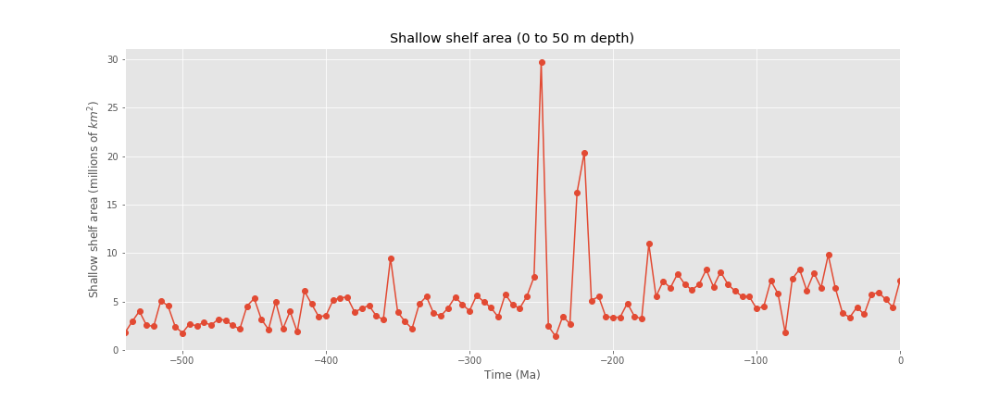

# Modelling changes in benthic O2 over the past 550 million years

Investigating the influence of temperature change, marine transgression and TOC delivery on shallow-shelf oxygen conditions.

## Preliminary data exploration

### Notebooks

 * **[GIS data for paleobathymetry](https://nbviewer.jupyter.org/github/NIVANorge/paleo_benthic_o2/blob/master/notebooks/paleomap_bathymetry.ipynb?flush_cache=true)**. Exploring datasets from the [PaleoDEM project](https://www.earthbyte.org/paleodem-resource-scotese-and-wright-2018/)
 
 

  
  

